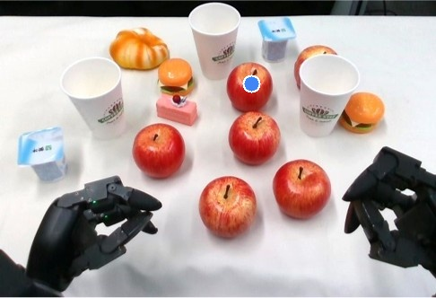
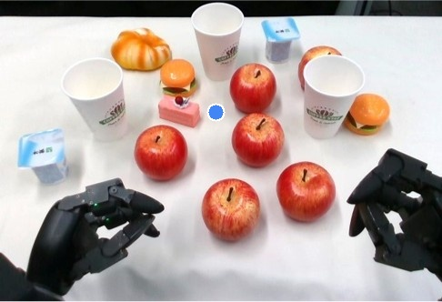
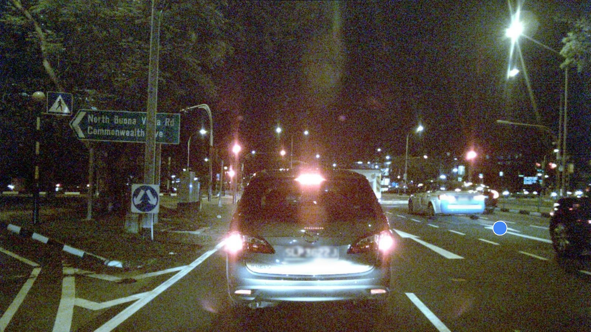
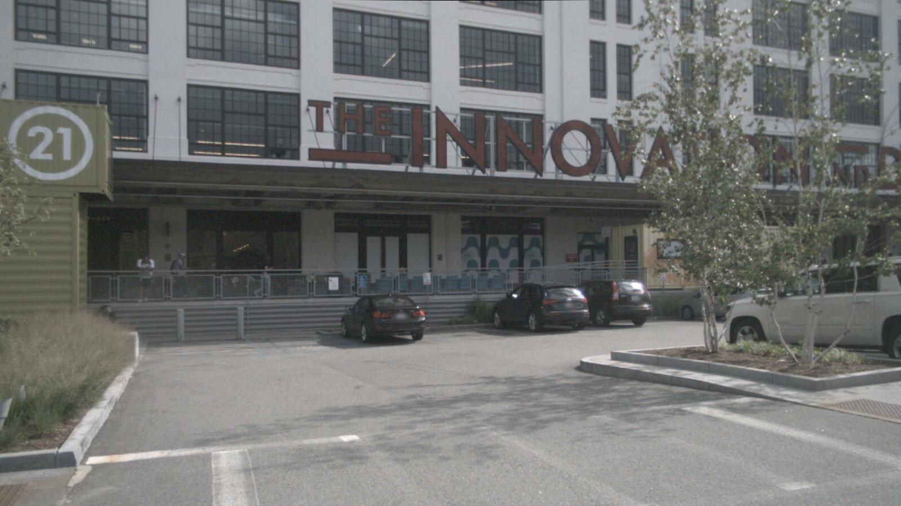
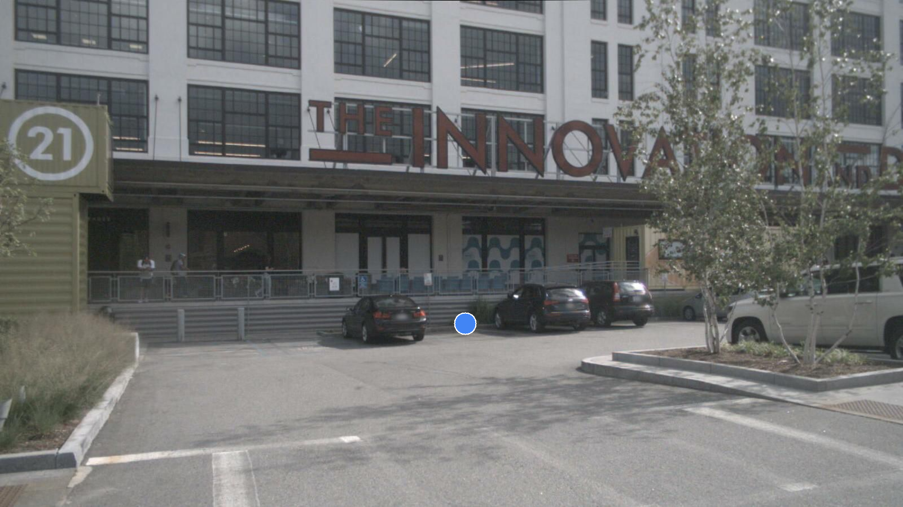
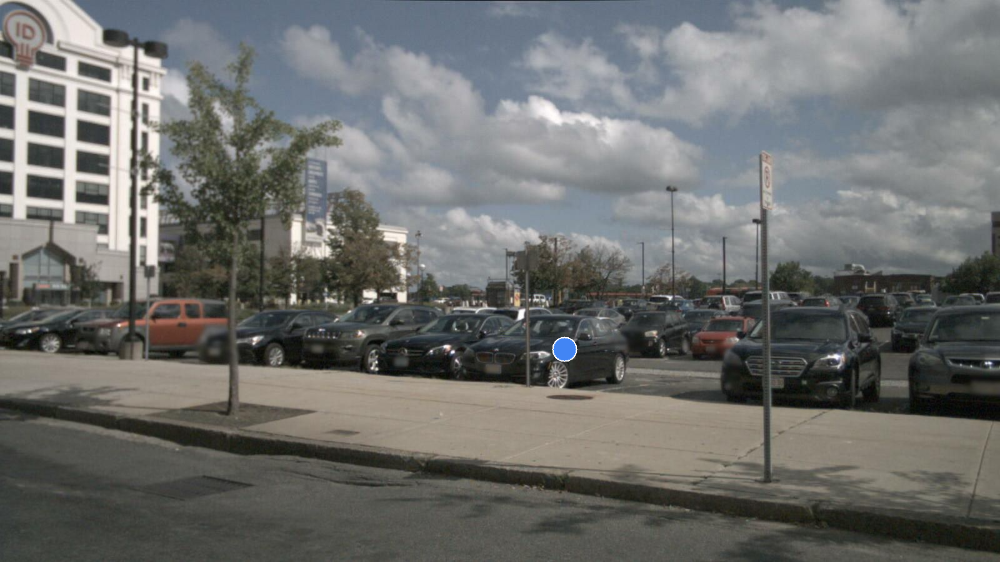
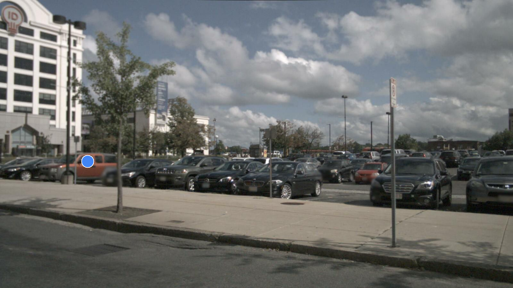

<h1 align="center">RoboRefer: Towards Spatial Referring with Reasoning in Vision-Language Models for Robotics</h1>

<h3 align="center">From words to exactly where you mean — with RoboRefer </h3>


<p align="center">
  <a href="https://arxiv.org/abs/2506.04308"></a>
  &nbsp;
  <a href="https://zhoues.github.io/RoboRefer/"></a>
  &nbsp;
  <a href="https://huggingface.co/datasets/JingkunAn/RefSpatial"></a>
  &nbsp;
  <a href="https://huggingface.co/datasets/BAAI/RefSpatial-Bench"></a>
  &nbsp;
  <a href="https://huggingface.co/collections/Zhoues/roborefer-and-refspatial-6857c97848fab02271310b89"></a>
</p>


<div style="text-align: center; background-color: white;">
    
</div>


## 🔥 Updates

[2025-12-16] 🔥🔥🔥 We’ve released RoboTracer, a more powerful version of RoboRefer, on [arxiv](https://arxiv.org/abs/2512.13660) and launched the [project page](https://zhoues.github.io/RoboTracer/). It retains all RoboRefer features while adding multi-step, metric-grounded spatial tracing with explicit reasoning. Come and try the newer dataset TraceSpatial and the more challenging benchmark TraceSpatial-Bench!

[2025-10-25] 🔥🔥🔥 [RefSpatial-Expand-Bench](https://huggingface.co/datasets/JingkunAn/RefSpatial-Expand-Bench) is now released! Based on the original benchmark, the new version expands indoor scenes (e.g., factories, stores) and introduces previously **unexplored outdoor scenarios (e.g., streets, parking lots)**, offering a **more comprehensive evaluation of spatial referring tasks**.

[2025-09-26] 🔥🔥🔥 RefSpatial-Bench is now used by [Qwen3-VL](https://github.com/QwenLM/Qwen3-VL) and [Gemini-Robotics-1.5](https://deepmind.google/discover/blog/gemini-robotics-15-brings-ai-agents-into-the-physical-world/) to evaluate spatial reasoning in complex embodied scenarios! Come on, test your model with RefSpatial-Bench!

<table>
  <tr>
    <th>Qwen3-VL Results</th>
    <th>Gemini-Robotics-1.5 Results</th>
  </tr>
  <tr>
    <td></td>
    <td></td>


</table>


[2025-09-18] 🔥🔥🔥 RoboRefer gets accepted to NeurIPS 2025! See you in Mexico City and San Diego, USA!

[2025-07-29] We release the SFT-trained 8B model and test examples of outdoor scenes.

[2025-07-01] We release the RefSpatial Dataset and SFT training code.

[2025-06-23] We release the SFT-trained 2B model and inference code with RefSpatial-Bench evaluation code.

[2025-06-06] RefSpatial-Bench is released on [HF](https://huggingface.co/datasets/BAAI/RefSpatial-Bench). Let's evaluate your model's spatial referring ability!

[2025-06-06] RoboRefer is released on [arxiv](https://arxiv.org/abs/2506.04308) and the project page is set up at [here](https://zhoues.github.io/RoboRefer/).


## 🤗 Model Zoo &  Dataset & Benchmark


<table>
  <tr>
    <th>Model/Dataset/Benchmark</th>
    <th>Note</th>
  </tr>
  <tr>
    <td><a href="https://huggingface.co/Zhoues/NVILA-2B-Depth">NVILA-2B-Depth</a></td>
    <td> The base model with depth encoder initialized from the image encoder. </td>
  </tr>
  <tr>
    <td><a href="https://huggingface.co/Zhoues/RoboRefer-2B-Depth-Align">RoboRefer-2B-Align</a></td>
    <td> The 1st SFT step of the 2B model for depth alignment. </td>
  </tr>
    <tr>
    <td><a href="https://huggingface.co/Zhoues/RoboRefer-2B-SFT">RoboRefer-2B-SFT</a></td>
    <td> The 2nd SFT step of the 2B model for spatial understanding and referring.</td>
  </tr>
  <tr>
    <td><a href="https://huggingface.co/Zhoues/NVILA-8B-Depth">NVILA-8B-Depth</a></td>
    <td> The base model with depth encoder initialized from the image encoder. </td>
  </tr>
  <tr>
    <td><a href="https://huggingface.co/Zhoues/RoboRefer-8B-SFT">RoboRefer-8B-SFT</a></td>
    <td> The 2nd SFT step of the 8B model for spatial understanding and referring.</td>
  </tr>
  <tr>
    <td>RoboRefer-2B-RFT (Coming soon)</td>
    <td> The RFT-trained 2B model for multi-step spatial referring with reasoning.</td>
  </tr>
  <tr>
    <td><a href="https://huggingface.co/datasets/JingkunAn/RefSpatial">RefSpatial Dataset</a></td>
    <td> The dataset for spatial understanding and referring with reasoning. </td>
  </tr>
  <tr>
    <td><a href="https://huggingface.co/datasets/BAAI/RefSpatial-Bench">RefSpatial-Bench</a></td>
    <td> The benchmark for spatial referring with reasoning. </td>
  </tr>
  <tr>
    <td><a href="https://huggingface.co/datasets/JingkunAn/RefSpatial-Expand-Bench">RefSpatial-Expand-Bench</a></td>
    <td> A more comprehensive benchmark for spatial referring with reasoning. </td>
  </tr>
</table>

## 🚀 Quick Start
1. Install [Anaconda Distribution](https://www.anaconda.com/download/).
2. Install the necessary Python packages in the environment.
      ```bash
      bash env_setup.sh roborefer
      ```
3. Activate a conda environment.
      ```bash
      conda activate roborefer
      ```


## 💡 Inference

1. Download the model weights from the [model zoo](#-model-zoo---dataset--benchmark) (e.g., `RoboRefer-2B-SFT`).

2. Download the relative depth estimation model weights (e.g., [`Depth-Anything-V2-Large`](https://huggingface.co/depth-anything/Depth-Anything-V2-Large/resolve/main/depth_anything_v2_vitl.pth?download=true)).

3. Run the inference api server.
      ```bash
      cd API 
      
      python api.py \
      --port 25547 \
      --depth_model_path /your/custom/path/depth_anything_v2_vitl.pth \
      --vlm_model_path /your/custom/path/to/roborefer
      ```

4. Run the inference script with the API and check the results in the `assets` folder.
> [!NOTE]
> RoboRefer natively supports both RGB and RGB-D inputs. If you don't have depth data, it can be inferred from RGB using DepthAnything V2 by setting `enable_depth=1`. Just set `enable_depth=0` for RGB-only input or `1` for RGB-D input in use_api.py. https://github.com/Zhoues/RoboRefer/blob/15f93d48c1e205d954eeb8de989cdae3cef7abbb/API/use_api.py#L61

      ```bash
      cd API 
      
      ## Tabletop scenes
      python use_api.py \
      --image_path ../assets/tabletop.jpg \
      --prompt "Pick the apple in front of the logo side of the leftmost cup." \
      --output_path ../assets/my_tabletop_result_1.jpg \
      --url http://127.0.0.1:25547

      python use_api.py \
      --image_path ../assets/tabletop.jpg \
      --prompt "Point out the apple nearest to the second cup from left to right." \
      --output_path ../assets/my_tabletop_result_2.jpg \
      --url http://127.0.0.1:25547

      python use_api.py \
      --image_path ../assets/tabletop.jpg \
      --prompt "Point to the free area between the farthest apple and pink cake." \
      --output_path ../assets/my_tabletop_result_3.jpg \
      --url http://127.0.0.1:25547

      ## Outdoor scenes
      python use_api.py \
      --image_path ../assets/outdoor_1.jpg \
      --prompt "Point to the free area between the black vehicle on the right and the white sedan in front of it." \
      --output_path ../assets/my_outdoor_result_1.jpg \
      --url http://127.0.0.1:25547

      python use_api.py \
      --image_path ../assets/outdoor_2.png \
      --prompt "Point to the free area between the first black vehicle and the second black vehicle from left to right." \
      --output_path ../assets/my_outdoor_result_2.png \
      --url http://127.0.0.1:25547

      python use_api.py \
      --image_path ../assets/outdoor_3.png \
      --prompt "Point to the third car in the row closest to the viewer, from right to left" \
      --output_path ../assets/my_outdoor_result_3.png \
      --url http://127.0.0.1:25547

      python use_api.py \
      --image_path ../assets/outdoor_3.png \
      --prompt "Point to the brown car in the row closest to the viewer" \
      --output_path ../assets/my_outdoor_result_4.png \
      --url http://127.0.0.1:25547
      ```

Below are the results of the inference as examples (tabletop scenes and outdoor scenes).

<table>
  <tr>
    <th>Original Image</th>
    <th>"Pick the apple in front of the logo side of the leftmost cup."</th>
    <th>"Point out the apple nearest to the second cup from left to right."</th>
    <th>"Point to the free area between the farthest apple and pink cake."</th>
  </tr>
  <tr>
    <td></td>
    <td></td>
    <td></td>
    <td></td>

</table>

<table>
  <tr>
    <th>Original Image</th>
    <th>"Point to the free area between the black vehicle on the right and the white sedan in front of it."</th>
  </tr>
  <tr>
    <td></td>
    <td></td>
  </tr>
</table>

<table>
  <tr>
    <th>Original Image</th>
    <th>"Point to the free area between the first black vehicle and the second black vehicle from left to right."</th>
  </tr>
  <tr>
    <td></td>
    <td></td>
  </tr>
</table>

<table>
  <tr>
    <th>Original Image</th>
    <th>"Point to the third car in the row closest to the viewer, from right to left"</th>
    <th>"Point to the brown car in the row closest to the viewer"</th>
  </tr>
  <tr>
    <td></td>
    <td></td>
    <td></td>
  </tr>
</table>


## 🔍 Evaluation for RefSpatial-Bench

1. Open the `Evaluation` folder and download the RefSpatial-Bench/RefSpatial-Expand-Bench from the [model zoo](#-model-zoo---dataset--benchmark).
    ```bash
    cd Evaluation
    git lfs install
    git clone https://huggingface.co/datasets/BAAI/RefSpatial-Bench
    # git clone https://huggingface.co/datasets/JingkunAn/RefSpatial-Expand-Bench
    ```

2. Run the API server as the same as the third step in [Inference](#-inference).
    ```bash
    cd API
    python api.py \
    --port 25547 \
    --depth_model_path /your/custom/path/depth_anything_v2_vitl.pth \
    --vlm_model_path /your/custom/path/to/roborefer
    ```

3. Run the evaluation script. 
    - If the `model_name` has `Depth` in the name, the depth model will be used. Therefore, you can choose `RoboRefer-2B-SFT`, `RoboRefer-2B-SFT-Depth` as the model name for RGB/RGB-D inference, respectively.
    - The `task_name` can be `Location`, `Placement`, `Unseen`, or `all` to evaluate on all tasks.

    ```bash
    cd Evaluation
    python test_benchmark.py \
    --model_name RoboRefer-2B-SFT-Depth \ 
    --task_name Location \
    --url http://127.0.0.1:25547
    ```

4. Summarize the results.
    - The `model_name` must be the same as the one used in the evaluation script.
    - The `task_name` can be `Location`/`Placement`/`Unseen` to summarize the results for the corresponding task.

    ```bash
    cd Evaluation
    python summarize_acc.py \
    --model_name RoboRefer-2B-SFT-Depth \
    --task_name Location
    ```

## 📚 Training

### Step 1: Download RefSpatial Dataset.
Download the RefSpatial dataset from the [model zoo](#-model-zoo---dataset--benchmark) and extract it by running the provided `unzip_dataset.sh` from the RefSpatial root directory to decompress all of the `*.tar.gz` files.
> [!NOTE]
> The full raw dataset (~357GB) is in the same format as the LLaVA dataset.

  ```bash
  cd RefSpatial
  bash unzip_dataset.sh
  ```


  This script will automatically perform the following actions:

  1. **Merge Split Files**: For files that are split into `.part_a`, `.part_b`, etc., the script will use the `cat` command to combine them into a single, complete `.tar.gz` file. For example, `image.tar.gz.part_a`, `...` will be merged into `image.tar.gz`.
  2. **Extract Archives**: The script will then use the `tar` command to extract all `.tar.gz` archives into their current directories.

### Step 2 (Optional): Clean up Archives.
To save disk space, delete all `.tar.gz` and `.part_*` files after successful decompression by running:

> [!Warning]
> Please run this script only after confirming that all data has been successfully decompressed.

```bash
bash delete_tar_gz.sh
```

### Step 3: Download base model weights.
Download the RoboRefer base model weights or depth aligned model weights from the [model zoo](#-model-zoo---dataset--benchmark).


### Step 4: Train the model.


#### Step 4.1: Add custom datasets (e.g., RefSpatial Dataset)

Add your dataset to the `register_datasets_mixtures()` function in `RoboRefer/llava/data/datasets_mixture.py`. The flexible `dataset_type` named `spatialdataset` supports both RGB-only and RGB-D training. For RGB-D training, set the `depth_path` in the dataset config. For RGB-only, just leave out the `depth_path`.

Below is an example of how to register the RefSpatial dataset for both RGB-only and RGB-D training in the `register_datasets_mixtures()` function in `RoboRefer/llava/data/datasets_mixture.py`. The RefSpatial dataset has already been implemented in its corresponding module.

<details>
<summary>Example of Adding RefSpatial Dataset</summary>
<pre><code>
def register_datasets_mixtures():

    ### OpenImage (2D Dataset)
    2D_choice_qa = Dataset(
        dataset_name="2D_choice_qa",
        dataset_type="spatialdataset",
        data_path="./RefSpatial/2D/choice_qa.json",
        image_path="./RefSpatial/2D/image",
        depth_path="./RefSpatial/2D/depth"
    )
    add_dataset(2D_choice_qa)

    2D_choice_qa_RGB = Dataset(
        dataset_name="2D_choice_qa_RGB",
        dataset_type="spatialdataset",
        data_path="./RefSpatial/2D/choice_qa.json",
        image_path="./RefSpatial/2D/image"
    )
    add_dataset(2D_choice_qa_RGB)

    2D_reasoning_template_qa = Dataset(
        dataset_name="2D_reasoning_template_qa",
        dataset_type="spatialdataset",
        data_path="./RefSpatial/2D/reasoning_template_qa.json",
        image_path="./RefSpatial/2D/image",
        depth_path="./RefSpatial/2D/depth"
    )
    add_dataset(2D_reasoning_template_qa)

    2D_reasoning_template_qa_RGB = Dataset(
        dataset_name="2D_reasoning_template_qa_RGB",
        dataset_type="spatialdataset",
        data_path="./RefSpatial/2D/reasoning_template_qa.json",
        image_path="./RefSpatial/2D/image"
    )
    add_dataset(2D_reasoning_template_qa_RGB)

    ### CA-1M (3D Dataset)
    3D_choice_qa = Dataset(
        dataset_name="3D_choice_qa",
        dataset_type="spatialdataset",
        data_path="./RefSpatial/3D/choice_qa.json",
        image_path="./RefSpatial/3D/image",
        depth_path="./RefSpatial/3D/depth"
    )
    add_dataset(3D_choice_qa)

    3D_choice_qa_RGB = Dataset(
        dataset_name="3D_choice_qa_RGB",
        dataset_type="spatialdataset",
        data_path="./RefSpatial/3D/choice_qa.json",
        image_path="./RefSpatial/3D/image"
    )
    add_dataset(3D_choice_qa_RGB)

    3D_reasoning_template_qa = Dataset(
        dataset_name="3D_reasoning_template_qa",
        dataset_type="spatialdataset",
        data_path="./RefSpatial/3D/reasoning_template_qa.json",
        image_path="./RefSpatial/3D/image",
        depth_path="./RefSpatial/3D/depth"
    )
    add_dataset(3D_reasoning_template_qa)

    3D_reasoning_template_qa_RGB = Dataset(
        dataset_name="3D_reasoning_template_qa_RGB",
        dataset_type="spatialdataset",
        data_path="./RefSpatial/3D/reasoning_template_qa.json",
        image_path="./RefSpatial/3D/image"
    )
    add_dataset(3D_reasoning_template_qa_RGB)

    3D_vacant_qa = Dataset(
        dataset_name="3D_vacant_qa",
        dataset_type="spatialdataset",
        data_path="./RefSpatial/3D/vacant_qa.json",
        image_path="./RefSpatial/3D/image",
        depth_path="./RefSpatial/3D/depth"
    )
    add_dataset(3D_vacant_qa)

    3D_vacant_qa_RGB = Dataset(
        dataset_name="3D_vacant_qa_RGB",
        dataset_type="spatialdataset",
        data_path="./RefSpatial/3D/vacant_qa.json",
        image_path="./RefSpatial/3D/image"
    )
    add_dataset(3D_vacant_qa_RGB)

    3D_multi_view_qa = Dataset(
        dataset_name="3D_multi_view_qa",
        dataset_type="spatialdataset",
        data_path="./RefSpatial/3D/multi_view_qa.json",
        image_path="./RefSpatial/3D/image_multi_view",
        depth_path="./RefSpatial/3D/depth_multi_view"
    )
    add_dataset(3D_multi_view_qa)

    3D_multi_view_qa_RGB = Dataset(
        dataset_name="3D_multi_view_qa_RGB",
        dataset_type="spatialdataset",
        data_path="./RefSpatial/3D/multi_view_qa.json",
        image_path="./RefSpatial/3D/image_multi_view"
    )
    add_dataset(3D_multi_view_qa_RGB)

    3D_visual_choice_qa = Dataset(
        dataset_name="3D_visual_choice_qa",
        dataset_type="spatialdataset",
        data_path="./RefSpatial/3D/visual_choice_qa.json",
        image_path="./RefSpatial/3D/image_visual_choice",
        depth_path="./RefSpatial/3D/depth"
    )
    add_dataset(3D_visual_choice_qa)

    3D_visual_choice_qa_RGB = Dataset(
        dataset_name="3D_visual_choice_qa_RGB",
        dataset_type="spatialdataset",
        data_path="./RefSpatial/3D/visual_choice_qa.json",
        image_path="./RefSpatial/3D/image_visual_choice"
    )
    add_dataset(3D_visual_choice_qa_RGB)

    ### Simulator (Simulator Dataset)
    simulation_dataset = Dataset(
        dataset_name="simulation_dataset",
        dataset_type="spatialdataset",
        data_path="./RefSpatial/Simulator/metadata.json",
        image_path="./RefSpatial/Simulator/image",
        depth_path="./RefSpatial/Simulator/depth"
    )
    add_dataset(simulation_dataset)

    simulation_dataset_RGB = Dataset(
        dataset_name="simulation_dataset_RGB",
        dataset_type="spatialdataset",
        data_path="./RefSpatial/Simulator/metadata.json",
        image_path="./RefSpatial/Simulator/image"
    )
    add_dataset(simulation_dataset_RGB)
</code></pre>

</details>


#### Step 4.2: Use scripts to start training
In `scripts/RoboRefer`, we provide scripts for depth alignment, SFT training, and RFT training (coming soon). You can run them using the commands below. Be sure to update the base model path and add your custom dataset(s) in the script. After registering your datasets in `register_datasets_mixtures()`, you can use `+` to include multiple datasets.

```bash
bash scripts/roborefer/depth_align_2B.sh # or bash scripts/roborefer/depth_align_2B_cluster.sh. If you use a cluster for training, you can run this script. 8B variant is the same.

bash scripts/roborefer/depth_sft_2B.sh # or bash scripts/roborefer/depth_sft_2B_cluster.sh. If you use a cluster for training, you can run this script. 8B variant is the same.
```
    

## 🕶️Overview

### The Overview of RoboRefer

We introduce RoboRefer, **the first 3D-aware reasoning VLM** for multi-step spatial referring with explicit reasoning.

<div align="center"> 
    
</div>


### The Overview of the RefSpatial Dataset and its Generation Pipeline

We present RefSpatial, a dataset can enable general VLMs to adapt to spatial referring tasks, with **20M QA pairs (2x prior)** and **31 spatial relations (vs. 15 prior)** and **complex reasoning processes (up to 5 steps)**.


<div align="center"> 
    
</div>


## TODO
- [x] Release RefSpatial-Bench evaluation code (About 1 week).
- [x] Release the SFT-trained 2B RoboRefer model and inference code (About 2 weeks).
- [x] Release the SFT-trained 8B RoboRefer model (About 3 weeks).
- [x] Release the RefSpatial Dataset and SFT training code (About 1 month).
- [ ] Release the RFT-trained RoboRefer model and training code (Maybe 2 months or more).
- [ ] Release the Dataset Generation Pipeline (Maybe 2 months or more).


## Contact
If you have any questions about the code or the paper, feel free to email Enshen (`zhouenshen@buaa.edu.cn`) and Jingkun (`anjingkun02@gmail.com`). 


## Acknowledgment
- This repository is built upon the codebase of [NVILA](https://github.com/NVlabs/VILA), [SpatialRGPT](https://github.com/AnjieCheng/SpatialRGPT) and [R1-V](https://github.com/Deep-Agent/R1-V).

- We acknowledge [OpenImage](https://storage.googleapis.com/openimages/web/index.html), [CA-1M](https://github.com/apple/ml-cubifyanything), [Objaverse](https://github.com/allenai/objaverse-xl), and [Infinigen](https://github.com/princeton-vl/infinigen) for their data and assets.


## 📑 Citation

If you find RoboRefer, RefSpatial, and RefeSpatial-Bench useful for your research, please cite using this BibTeX:
```
@article{zhou2025roborefer,
  title={RoboRefer: Towards Spatial Referring with Reasoning in Vision-Language Models for Robotics},
  author={Zhou, Enshen and An, Jingkun and Chi, Cheng and Han, Yi and Rong, Shanyu and Zhang, Chi and Wang, Pengwei and Wang, Zhongyuan and Huang, Tiejun and Sheng, Lu and others},
  journal={arXiv preprint arXiv:2506.04308},
  year={2025}
}
```
